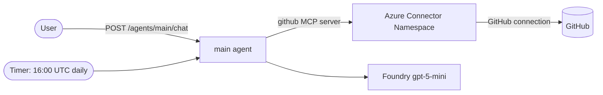

# Daily Repo Digest — Azure Functions Serverless Agent

This sample is a **serverless AI agent** built on the [Azure Functions Serverless Agents Runtime (preview)](https://learn.microsoft.com/azure/azure-functions/functions-serverless-agents-runtime). It creates a daily GitHub repo digest for `Azure/azure-functions-host` by default and answers interactive questions about repository activity.

Agents are defined as markdown files (`*.agent.md`) and connect to external systems through MCP servers declared in `mcp.json`. The app deploys to an [Azure Functions Flex Consumption](https://learn.microsoft.com/azure/azure-functions/flex-consumption-plan) app with [Azure Developer CLI (`azd`)](https://learn.microsoft.com/azure/developer/azure-developer-cli/), and uses a Microsoft Foundry model deployment for inference.

The app hosts a single agent, **`main`**, that does double duty:

- **On a timer** — it builds a repo digest once a day and writes it to the function logs.
- **On demand** — its built-in HTTP endpoints (chat API + browser chat UI) let you ask about recent PRs, issues, or failing workflow runs any time.

The agent reads GitHub through a **GitHub connector published as an MCP server by an [Azure Connector Namespace](https://learn.microsoft.com/azure/logic-apps/connector-namespace/connector-namespace-overview) (preview)**. The connector namespace stores the GitHub connection and its credentials, and exposes the GitHub MCP tools (issues, pull requests, and Actions workflow runs) to the agent — so there is no custom API-client code or GitHub token in the app.

> This is the Azure Functions equivalent of the Foundry Hosted Agent sample. Looking for other language versions? See [C#](https://github.com/Azure-Samples/simple-agent-functions-dotnet) or [TypeScript](https://github.com/Azure-Samples/simple-agent-functions-typescript).

## Architecture



## Prerequisites

- [Python 3.13+](https://www.python.org/downloads/)
- [Azure Functions Core Tools v4](https://learn.microsoft.com/azure/azure-functions/functions-run-local) (for local runs)
- [Azure Developer CLI (azd) 1.27.0+](https://learn.microsoft.com/azure/developer/azure-developer-cli/install-azd)
- [Azurite](https://learn.microsoft.com/azure/storage/common/storage-use-azurite) for local storage emulation
- An Azure subscription with access to Microsoft Foundry model deployments

The included [dev container](.devcontainer/devcontainer.json) installs these tools automatically.

## Run locally

Provision just the Foundry project and model so you have an endpoint to point at (this creates the resource group, Foundry account/project, model deployment, storage, and function app):

```bash
azd provision
```

Copy the local settings sample and fill in the Foundry project endpoint (azd prints it as `FOUNDRY_PROJECT_ENDPOINT`):

```bash
cd src
cp local.settings.json.sample local.settings.json
```

Set `FOUNDRY_PROJECT_ENDPOINT` in `src/local.settings.json`, then sign in so the runtime can authenticate to Foundry with your identity:

```bash
az login
```

To exercise the GitHub tools locally, set `GITHUB_MCP_SERVER_URL` in `src/local.settings.json` to the connector namespace MCP endpoint from a deployed environment (`azd env get-values` prints it as `GITHUB_MCP_SERVER_URL`); your `az login` identity is granted access to the connection during provisioning. Without it, the chat UI still runs, but GitHub lookups are unavailable. GitHub tools are simplest to try in the deployed app, where the function's managed identity is already authorized.

Start the agents (Azurite is started automatically by Core Tools if the Azurite extension is running, or run `azurite` in a separate terminal):

```bash
func start
```

Then open the built-in chat UI at <http://localhost:7071/agents/main/> and chat with the `main` agent, or call the chat endpoint directly:

```bash
curl -sS -X POST http://localhost:7071/agents/main/chat \
  -H "Content-Type: application/json" \
  -d '{"prompt": "Create a concise repo digest for Azure/azure-functions-host."}'
```

You can also use the sample requests in [`test.http`](test.http).

## Deploy to Azure

Provision infrastructure and deploy the app in one step:

```bash
azd up
```

`azd` provisions the function app (Flex Consumption), a Microsoft Foundry project with a `gpt-5-mini` deployment, storage, Application Insights, a user-assigned managed identity with the required role assignments, and an **Azure Connector Namespace** with a GitHub connection published as an MCP server. The function app authenticates to Foundry, storage, and the connector MCP server with the managed identity — no keys or GitHub tokens in app settings.

### Authorize the GitHub connection

The GitHub connection is created empty and must be authorized once (OAuth consent) before the agent can read GitHub:

1. In the [Azure portal](https://portal.azure.com), open the connector namespace (resource name starts with `cg-`, output as `GITHUB_CONNECTOR_GATEWAY_NAME`).
2. Open the **github** connection and select **Authorize** / **Sign in**, then complete the GitHub OAuth consent.

The connection is reusable, so this is a one-time step per environment.

Once deployed and authorized, open the built-in chat UI at `https://<your-function-app>.azurewebsites.net/agents/main/`, or send a request to the chat endpoint (get the function app name from `azd env get-values`):

```bash
curl -sS -X POST https://<your-function-app>.azurewebsites.net/agents/main/chat \
  -H "Content-Type: application/json" \
  -H "x-functions-key: <function-key>" \
  -d '{"prompt": "Create a concise repo digest."}'
```

## Configuration

Set configuration through `azd` environment values before `azd provision`/`azd up`:

```bash
# Digest a different repository (default: Azure/azure-functions-host)
azd env set GITHUB_REPOSITORY "owner/repo"
```

`GITHUB_REPOSITORY` becomes an app setting the agent uses to target the repo. GitHub access itself goes through the connector namespace's GitHub MCP server — `azd` wires `GITHUB_MCP_SERVER_URL` and `GITHUB_MCP_CLIENT_ID` into the app automatically (see [`src/mcp.json`](src/mcp.json)), so there is no GitHub token to manage. Remember to [authorize the GitHub connection](#authorize-the-github-connection) once after the first deploy.

> **Preview:** Azure Connector Namespace is in preview — availability is limited to a subset of regions and it has no production SLA yet. See the [connector namespace overview](https://learn.microsoft.com/azure/logic-apps/connector-namespace/connector-namespace-overview) for current limits.

Other settings you can tune in `infra/main.parameters.json` (or via matching `azd env set` values): `FOUNDRY_MODEL`, `FOUNDRY_MODEL_VERSION`, and `FOUNDRY_DEPLOYMENT_CAPACITY`.

### Schedule and time zone

The `main` agent runs on the NCRONTAB schedule `0 0 16 * * *` — **16:00 UTC**, which is **9 AM Pacific Daylight Time** (8 AM during Pacific Standard Time). Linux Flex Consumption does not support the `WEBSITE_TIME_ZONE`/`TZ` setting, so the schedule is expressed in UTC. Adjust the `schedule` in [`src/main.agent.md`](src/main.agent.md) if you need a different time.

## Project structure

```
azure.yaml                       azd configuration (deploys ./src as a function app)
infra/                           Bicep infrastructure
  main.bicep                       resource group, identity, Foundry, connector namespace, function app
  app/{api,foundry,rbac}.bicep     function app, Foundry account/model, role assignments
  app/connector-gateway.bicep      GitHub connector namespace + connection + MCP server config
src/
  function_app.py                  app = create_function_app()
  main.agent.md                    timer-triggered digest agent with a built-in chat interface
  mcp.json                         GitHub MCP server (Azure Connector Namespace) the agent consumes
  agents.config.yaml               shared model + timeout configuration
  host.json                        Functions host configuration
  requirements.txt                 azurefunctions-agents-runtime
  local.settings.json.sample       local configuration template
test.http                        sample REST Client requests
```

## How it was built

This project started as a Foundry Hosted Agent (Microsoft Agent Framework running in a container) and was converted to the Azure Functions serverless agents model:

- The agent instructions moved from Python (`repo_digest_agent.py`) into a single markdown agent file (`src/main.agent.md`).
- The custom `get_repo_digest` Python tool was replaced by the **GitHub managed connector**, published as an MCP server by an Azure Connector Namespace and declared in `src/mcp.json` — the agent now calls GitHub MCP tools instead of hand-written REST code.
- Container hosting (`Dockerfile`, `main.py`, `agent.yaml`) was replaced by the Functions host. The Foundry daily *routine* and the interactive Responses endpoint collapsed into one agent that carries both a `timer_trigger` and built-in chat endpoints.

## Learn more

- [Serverless agents runtime overview](https://learn.microsoft.com/azure/azure-functions/functions-serverless-agents-runtime)
- [Build AI agents with the serverless agents runtime](https://learn.microsoft.com/azure/azure-functions/scenario-serverless-agents-runtime)
- [Azure Connector Namespace overview](https://learn.microsoft.com/azure/logic-apps/connector-namespace/connector-namespace-overview)
- [GitHub connector reference](https://learn.microsoft.com/connectors/github/)
- [Azure Functions Flex Consumption](https://learn.microsoft.com/azure/azure-functions/flex-consumption-plan)
- [Azure Developer CLI](https://learn.microsoft.com/azure/developer/azure-developer-cli/)
