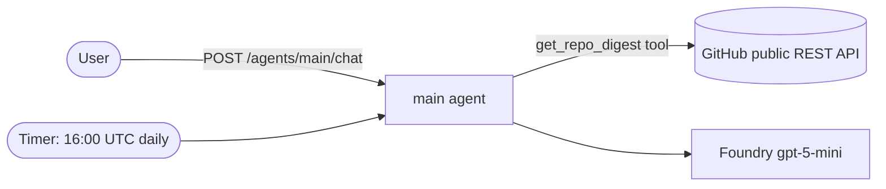

# Daily Repo Digest — Azure Functions Serverless Agent

This sample is a **serverless AI agent** built on the [Azure Functions Serverless Agents Runtime (preview)](https://learn.microsoft.com/azure/azure-functions/functions-serverless-agents-runtime). It creates a daily GitHub repo digest for `Azure/azure-functions-host` by default and answers interactive questions about repository activity.

Agents are defined as markdown files (`*.agent.md`) and call custom Python tools in `tools/`. The app deploys to an [Azure Functions Flex Consumption](https://learn.microsoft.com/azure/azure-functions/flex-consumption-plan) app with [Azure Developer CLI (`azd`)](https://learn.microsoft.com/azure/developer/azure-developer-cli/), and uses a Microsoft Foundry model deployment for inference.

The app hosts a single agent, **`main`**, that does double duty:

- **On a timer** — it builds a repo digest once a day and writes it to the function logs.
- **On demand** — its built-in HTTP endpoints (chat API + browser chat UI) let you ask about recent PRs or issues any time.

The agent reads GitHub through a single Python tool, [`get_repo_digest`](src/tools/repo_digest.py), which calls the **public GitHub REST API with no authentication** — so the sample runs with zero secrets. (Unauthenticated calls are limited to ~60 requests/hour and see public repositories only, which is plenty for a daily digest of a public repo. Set an optional `GITHUB_TOKEN` to raise the limit.)

> This is the Azure Functions equivalent of the Foundry Hosted Agent sample. Looking for other language versions? See [C#](https://github.com/Azure-Samples/simple-agent-functions-dotnet) or [TypeScript](https://github.com/Azure-Samples/simple-agent-functions-typescript).

## Architecture



## Prerequisites

- [uv](https://docs.astral.sh/uv/getting-started/installation/) — manages the Python environment (it installs and pins Python 3.13 for you)
- [Azure Functions Core Tools v4](https://learn.microsoft.com/azure/azure-functions/functions-run-local) (for local runs)
- [Azure Developer CLI (azd) 1.27.0+](https://learn.microsoft.com/azure/developer/azure-developer-cli/install-azd)
- [Azurite](https://learn.microsoft.com/azure/storage/common/storage-use-azurite) for local storage emulation
- An Azure subscription with access to Microsoft Foundry model deployments

The included [dev container](.devcontainer/devcontainer.json) installs these tools automatically.

## Run locally

**1. Provision Azure resources** so you have a Foundry endpoint to point at (creates the resource group, Foundry account/project, model deployment, storage, and function app):

```bash
azd provision
```

The `postprovision` hook writes `src/local.settings.json` for you from the azd environment (via [`infra/scripts/createlocalsettings.sh`](infra/scripts/createlocalsettings.sh)) — no manual copy step, and an existing file is left untouched.

**2. Install dependencies** with uv (creates a virtual environment and pins Python 3.13):

```bash
cd src
uv sync
```

**3. Sign in** so the runtime can authenticate to Foundry with your identity:

```bash
az login
```

**4. Start the agent** (Azurite is started automatically by Core Tools if the Azurite extension is running, or run `azurite` in a separate terminal):

```bash
uv run func start
```

Then open the built-in chat UI at <http://localhost:7071/agents/main/> and chat with the `main` agent, or call the chat endpoint directly:

```bash
curl -sS -X POST http://localhost:7071/agents/main/chat \
  -H "Content-Type: application/json" \
  -d '{"prompt": "Create a concise repo digest for Azure/azure-functions-host."}'
```

You can also use the sample requests in [`test.http`](test.http).

## Deploy to Azure

Provision infrastructure and deploy the app in one step:

```bash
azd up
```

`azd` provisions the function app (Flex Consumption), a Microsoft Foundry project with a `gpt-5-mini` deployment, storage, Application Insights, and a user-assigned managed identity with the required role assignments. The function app authenticates to Foundry and storage with the managed identity — no keys or GitHub tokens in app settings. During packaging, the `prepackage` hook regenerates `requirements.txt` from `uv.lock` so the deployed dependencies match your lockfile exactly.

Once deployed, open the built-in chat UI at `https://<your-function-app>.azurewebsites.net/agents/main/`, or send a request to the chat endpoint (get the function app name from `azd env get-values`):

```bash
curl -sS -X POST https://<your-function-app>.azurewebsites.net/agents/main/chat \
  -H "Content-Type: application/json" \
  -H "x-functions-key: <function-key>" \
  -d '{"prompt": "Create a concise repo digest."}'
```

## Configuration

Set configuration through `azd` environment values before `azd provision`/`azd up`:

```bash
# Digest a different repository (default: Azure/azure-functions-host)
azd env set GITHUB_REPOSITORY "owner/repo"
```

`GITHUB_REPOSITORY` becomes an app setting the agent uses to target the repo. GitHub access goes through the public REST API, so there is no token to manage by default. To raise the unauthenticated rate limit (or read a private repo), add a token as an app setting:

```bash
azd env set GITHUB_TOKEN "<your-pat>"   # optional
```

Other settings you can tune in `infra/main.parameters.json` (or via matching `azd env set` values): `FOUNDRY_MODEL`, `FOUNDRY_MODEL_VERSION`, and `FOUNDRY_DEPLOYMENT_CAPACITY`.

### Managing dependencies with uv

`uv.lock` is the single source of truth for dependencies. Add or update packages with `uv add <package>` / `uv lock --upgrade`, and commit the updated `pyproject.toml` + `uv.lock`. `requirements.txt` is generated automatically from the lockfile at deploy time (the `prepackage` hook), so you never edit it by hand.

### Schedule and time zone

The `main` agent runs on the NCRONTAB schedule `0 0 16 * * *` — **16:00 UTC**, which is **9 AM Pacific Daylight Time** (8 AM during Pacific Standard Time). Linux Flex Consumption does not support the `WEBSITE_TIME_ZONE`/`TZ` setting, so the schedule is expressed in UTC. Adjust the `schedule` in [`src/main.agent.md`](src/main.agent.md) if you need a different time.

## Project structure

```
azure.yaml                       azd configuration (deploys ./src; uv + local-settings hooks)
infra/                           Bicep infrastructure
  main.bicep                       resource group, identity, Foundry, function app
  app/{api,foundry,rbac}.bicep     function app, Foundry account/model, role assignments
  scripts/                         postprovision scripts that write src/local.settings.json
src/
  function_app.py                  app = create_function_app()
  main.agent.md                    timer-triggered digest agent with a built-in chat interface
  tools/repo_digest.py             get_repo_digest tool (public GitHub REST API, no auth)
  agents.config.yaml               shared model + timeout configuration
  host.json                        Functions host configuration
  pyproject.toml                   Python project + dependencies (managed by uv)
  uv.lock                          pinned dependency lockfile (source of truth)
  requirements.txt                 generated from uv.lock at deploy time
  local.settings.json.sample       local configuration template
test.http                        sample REST Client requests
```

## How it was built

This project started as a Foundry Hosted Agent (Microsoft Agent Framework running in a container) and was converted to the Azure Functions serverless agents model:

- The agent instructions moved from Python (`repo_digest_agent.py`) into a single markdown agent file (`src/main.agent.md`).
- The `get_repo_digest` tool carried over almost verbatim — it just uses the runtime's `@tool` decorator (`azure_functions_agents`) instead of the Agent Framework's, and still calls the public GitHub REST API directly.
- Container hosting (`Dockerfile`, `main.py`, `agent.yaml`) was replaced by the Functions host. The Foundry daily *routine* and the interactive Responses endpoint collapsed into one agent that carries both a `timer_trigger` and built-in chat endpoints.

## Learn more

- [Serverless agents runtime overview](https://learn.microsoft.com/azure/azure-functions/functions-serverless-agents-runtime)
- [Build AI agents with the serverless agents runtime](https://learn.microsoft.com/azure/azure-functions/scenario-serverless-agents-runtime)
- [Azure Functions Flex Consumption](https://learn.microsoft.com/azure/azure-functions/flex-consumption-plan)
- [Azure Developer CLI](https://learn.microsoft.com/azure/developer/azure-developer-cli/)
- [uv — Python packaging](https://docs.astral.sh/uv/)
