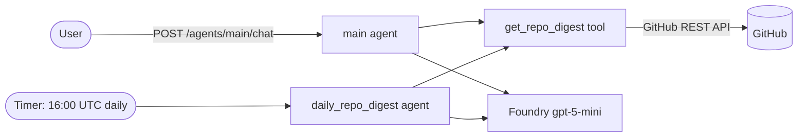

# Daily Repo Digest — Azure Functions Serverless Agent

This sample is a **serverless AI agent** built on the [Azure Functions Serverless Agents Runtime (preview)](https://learn.microsoft.com/azure/azure-functions/functions-serverless-agents-runtime). It creates a daily GitHub repo digest for `Azure/azure-functions-host` by default and answers interactive questions about repository activity.

Agents are defined as markdown files (`*.agent.md`) and custom capabilities are plain Python functions in `tools/`. The app deploys to an [Azure Functions Flex Consumption](https://learn.microsoft.com/azure/azure-functions/flex-consumption-plan) app with [Azure Developer CLI (`azd`)](https://learn.microsoft.com/azure/developer/azure-developer-cli/), and uses a Microsoft Foundry model deployment for inference.

The app hosts two agents:

- **`main`** — a chat agent with built-in HTTP endpoints (chat API + browser debug UI). Ask it about recent PRs, issues, or failing workflow runs any time.
- **`daily_repo_digest`** — a timer-triggered agent that builds a digest once a day and writes it to the function logs.

Both agents share the `get_repo_digest` tool, which gathers recent GitHub activity (merged/open PRs, new/closed issues, and failing workflow runs).

> This is the Azure Functions equivalent of the Foundry Hosted Agent sample. Looking for other language versions? See [C#](https://github.com/Azure-Samples/simple-agent-functions-dotnet) or [TypeScript](https://github.com/Azure-Samples/simple-agent-functions-typescript).

## Architecture



## Prerequisites

- [Python 3.13+](https://www.python.org/downloads/)
- [Azure Functions Core Tools v4](https://learn.microsoft.com/azure/azure-functions/functions-run-local) (for local runs)
- [Azure Developer CLI (azd) 1.27.0+](https://learn.microsoft.com/azure/developer/azure-developer-cli/install-azd)
- [Azurite](https://learn.microsoft.com/azure/storage/common/storage-use-azurite) for local storage emulation
- An Azure subscription with access to Microsoft Foundry model deployments

The included [dev container](.devcontainer/devcontainer.json) installs these tools automatically.

## Run locally

Provision just the Foundry project and model so you have an endpoint to point at (this creates the resource group, Foundry account/project, model deployment, storage, and function app):

```bash
azd provision
```

Copy the local settings sample and fill in the Foundry project endpoint (azd prints it as `FOUNDRY_PROJECT_ENDPOINT`):

```bash
cd src
cp local.settings.json.sample local.settings.json
```

Set `FOUNDRY_PROJECT_ENDPOINT` in `src/local.settings.json`, then sign in so the runtime can authenticate to Foundry with your identity:

```bash
az login
```

Start the agents (Azurite is started automatically by Core Tools if the Azurite extension is running, or run `azurite` in a separate terminal):

```bash
func start
```

Then chat with the `main` agent:

```bash
curl -sS -X POST http://localhost:7071/agents/main/chat \
  -H "Content-Type: application/json" \
  -d '{"prompt": "Create a concise repo digest for Azure/azure-functions-host."}'
```

Or open the built-in debug chat UI at <http://localhost:7071/agents/main/>, use the requests in [`test.http`](test.http), or run the console client:

```bash
python chat.py
```

## Deploy to Azure

Provision infrastructure and deploy the app in one step:

```bash
azd up
```

`azd` provisions the function app (Flex Consumption), a Microsoft Foundry project with a `gpt-5-mini` deployment, storage, Application Insights, and a user-assigned managed identity with the required role assignments. The function app authenticates to Foundry and storage with the managed identity — no keys in app settings.

Send a request to the deployed chat endpoint (get the function app name from `azd env get-values`):

```bash
curl -sS -X POST https://<your-function-app>.azurewebsites.net/agents/main/chat \
  -H "Content-Type: application/json" \
  -H "x-functions-key: <function-key>" \
  -d '{"prompt": "Create a concise repo digest."}'
```

## Configuration

Set configuration through `azd` environment values before `azd provision`/`azd up`:

```bash
# Digest a different repository (default: Azure/azure-functions-host)
azd env set GITHUB_REPOSITORY "owner/repo"

# Optional: raise GitHub API rate limits with a token
azd env set GITHUB_TOKEN "<your-github-token>"
```

These become the `GITHUB_REPOSITORY` and `GITHUB_TOKEN` app settings, which the `get_repo_digest` tool reads. For local runs, set the same values in `src/local.settings.json`.

Other settings you can tune in `infra/main.parameters.json` (or via matching `azd env set` values): `FOUNDRY_MODEL`, `FOUNDRY_MODEL_VERSION`, and `FOUNDRY_DEPLOYMENT_CAPACITY`.

### Schedule and time zone

The daily agent runs on the NCRONTAB schedule `0 0 16 * * *` — **16:00 UTC**, which is **9 AM Pacific Daylight Time** (8 AM during Pacific Standard Time). Linux Flex Consumption does not support the `WEBSITE_TIME_ZONE`/`TZ` setting, so the schedule is expressed in UTC. Adjust the `schedule` in [`src/daily_repo_digest.agent.md`](src/daily_repo_digest.agent.md) if you need a different time.

## Project structure

```
azure.yaml                       azd configuration (deploys ./src as a function app)
infra/                           Bicep infrastructure
  main.bicep                       resource group, identity, Foundry, function app, monitoring
  app/{api,foundry,rbac}.bicep     function app, Foundry account/model, role assignments
src/
  function_app.py                  app = create_function_app()
  main.agent.md                    chat agent with built-in endpoints
  daily_repo_digest.agent.md       timer-triggered daily digest agent
  agents.config.yaml               shared model + timeout configuration
  host.json                        Functions host configuration
  requirements.txt                 azurefunctions-agents-runtime
  local.settings.json.sample       local configuration template
  tools/
    get_repo_digest.py             gathers GitHub PRs, issues, and workflow runs
chat.py                          console chat client
test.http                        sample REST Client requests
```

## How it was built

This project started as a Foundry Hosted Agent (Microsoft Agent Framework running in a container) and was converted to the Azure Functions serverless agents model:

- The agent instructions moved from Python (`repo_digest_agent.py`) into markdown agent files.
- The `get_repo_digest` tool moved into `src/tools/` as a runtime tool.
- Container hosting (`Dockerfile`, `main.py`, `agent.yaml`) was replaced by the Functions host, and the Foundry daily *routine* was replaced by a timer-triggered agent.

## Learn more

- [Serverless agents runtime overview](https://learn.microsoft.com/azure/azure-functions/functions-serverless-agents-runtime)
- [Build AI agents with the serverless agents runtime](https://learn.microsoft.com/azure/azure-functions/scenario-serverless-agents-runtime)
- [Azure Functions Flex Consumption](https://learn.microsoft.com/azure/azure-functions/flex-consumption-plan)
- [Azure Developer CLI](https://learn.microsoft.com/azure/developer/azure-developer-cli/)
